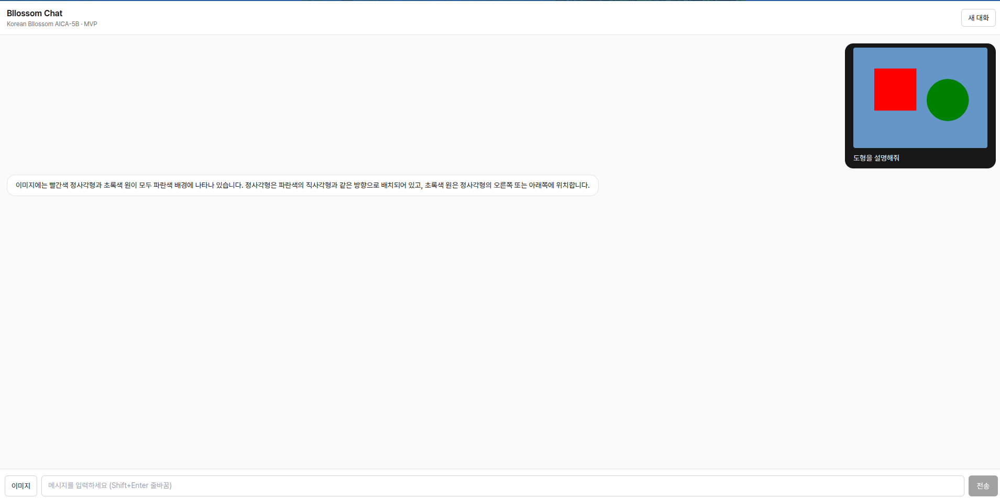

# 🌸 Korean Bllossom AICA-5B 양자화 챗봇

> RTX 4060 8GB에서 동작하는 한국어 비전-언어 챗 인터페이스
> FastAPI 백엔드 + React 프론트엔드 + 4-bit NF4 양자화


---

## 🖼️ 데모



> 빨간 정사각형과 초록 원이 그려진 이미지를 업로드하고 **"도형을 설명해줘"**라고 물으면,
> Bllossom AICA-5B가 한국어로 도형의 색·모양·배치를 설명해주는 모습입니다.

화면 구성:
- **상단 헤더** — `Bllossom Chat` / `Korean Bllossom AICA-5B · MVP` / `새 대화` 버튼
- **메시지 영역** — 사용자 메시지(검정 배경, 이미지 포함)와 어시스턴트 응답(흰 카드)
- **하단 입력바** — `이미지` 첨부 / `메시지 입력` textarea (Shift+Enter 줄바꿈, IME-safe) / `전송`

---

## 📋 프로젝트 개요

[Bllossom/llama-3.2-Korean-Bllossom-AICA-5B](https://huggingface.co/Bllossom/llama-3.2-Korean-Bllossom-AICA-5B)
(Mllama 계열 한국어 비전-언어 모델)을 RTX 4060 8GB에서 효율적으로 실행하기 위해
**4-bit NF4 양자화**를 적용하고, FastAPI 스트리밍 API + React UI를 얹은 단일 사용자용 MVP입니다.

### ✨ 주요 특징

- **🎯 RTX 4060 8GB 최적화** — NF4 4bit + double quant + `bfloat16` → VRAM 75% 절감
- **💬 텍스트 + 이미지 멀티모달 채팅** — 한 입력창에서 텍스트만 / 이미지+텍스트 모두 지원
- **🔄 토큰 스트리밍** — `TextIteratorStreamer` + HTTP chunked → 첫 토큰까지의 지연 최소화
- **🌐 한국어 IME 안전** — 한글 조합 중 Enter는 전송하지 않음 (한국어 챗 #1 footgun 차단)
- **🛠️ 분리된 백엔드/프론트엔드** — 백엔드만 단독으로 CLI/배치 사용 가능
- **📊 실시간 VRAM 모니터링** — `psutil` + `torch.cuda` 통계 출력

### 🎮 지원 하드웨어

| GPU 모델 | VRAM | 지원 여부 | 비고 |
|----------|------|-----------|------|
| RTX 4060 | 8GB  | ✅ 최적화 대상 | 기본 설정 그대로 동작 |
| RTX 4060 Ti / 4070 | 12-16GB | ✅ 권장 | `max_tokens` 늘려도 여유 |
| RTX 3060 | 12GB | ✅ 양호 | 속도는 다소 느림 |
| RTX 3060 Ti | 8GB | ⚠️ 제한 | 다른 프로세스 종료 권장 |
| < 6GB | - | ❌ | OOM 가능성 큼 |

---

## 📁 프로젝트 구조

```
korean-bllossom-quantized/
├── backend/                       # Python · FastAPI · PyTorch
│   ├── api.py                     # FastAPI 진입점 (/api/chat, /api/reset, /api/health)
│   ├── main.py                    # CLI 메뉴 / 데모 모드 / 시스템 점검
│   ├── config.yaml                # 모델·양자화·생성 파라미터
│   ├── core/
│   │   ├── config.py              # YAML → dataclass 매핑
│   │   ├── model_manager.py       # 모델 로딩/언로딩 (싱글톤)
│   │   ├── text_generator.py      # 텍스트 생성 / 대화 관리
│   │   └── vision_generator.py    # 비전-언어 생성 / 문서 처리
│   ├── interfaces/cli_interface.py
│   ├── requirements.txt
│   └── scripts/setup.sh
│
├── frontend/                      # React 18 · TypeScript · Vite · Tailwind
│   ├── index.html
│   ├── src/
│   │   ├── App.tsx                # 채팅 컨테이너
│   │   ├── components/
│   │   │   ├── ChatInput.tsx      # 입력바 (텍스트 + 이미지 첨부)
│   │   │   └── ChatMessage.tsx    # 말풍선 (스트리밍 커서 포함)
│   │   └── api/chat.ts            # fetch + ReadableStream 스트리밍 클라이언트
│   ├── package.json
│   └── vite.config.ts             # /api → 127.0.0.1:8000 프록시
│
├── docs/
│   ├── ARCHITECTURE.md            # 시스템 아키텍처 문서
│   └── UML.md                     # Mermaid UML 다이어그램 10종
│
├── demo.png                       # 위 데모 스크린샷
├── LICENSE
└── README.md                      # 본 문서
```

---

## 🚀 빠른 시작

### 0. 사전 요구사항

```bash
nvidia-smi             # CUDA GPU 확인
python3 --version      # 3.8 이상
node --version         # 18.18.x (frontend/.nvmrc 참조)
df -h                  # 모델 캐시용 50GB 여유 권장
```

### 1. 백엔드 설치 & 실행

```bash
cd backend

# (권장) 가상환경
python3 -m venv .venv
source .venv/bin/activate

# 의존성 설치
pip install -r requirements.txt

# 모델 다운로드는 최초 실행 시 자동 (~/.cache/huggingface)
uvicorn api:app --host 127.0.0.1 --port 8000 --workers 1
```

GPU 없이 프론트엔드만 개발하려면:

```bash
MODEL_SKIP_LOAD=1 uvicorn api:app --port 8000
# /api/chat 호출 시 503을 반환하지만 UI는 정상 동작
```

### 2. 프론트엔드 설치 & 실행

```bash
cd frontend
pnpm install        # 또는 npm install
pnpm dev            # http://127.0.0.1:5173
```

Vite 개발 서버가 `/api/*` 요청을 `127.0.0.1:8000`으로 프록시합니다(`vite.config.ts`).

### 3. 사용

브라우저에서 <http://127.0.0.1:5173> 접속 → 메시지 입력 또는 `이미지` 버튼으로 사진 첨부 → `전송`.

---

## 🔌 백엔드 API

| Method | Path | 입력 | 출력 |
|--------|------|------|------|
| `GET`  | `/api/health` | — | `{ ok, model_loaded, history_turns }` |
| `POST` | `/api/reset`  | — | `{ ok: true }` (서버 대화 히스토리 초기화) |
| `POST` | `/api/chat`   | `multipart/form-data`: `prompt`, `image?`, `max_new_tokens?`, `temperature?` | `text/plain; charset=utf-8` 청크 스트림 |

### 동작 제약 (단일 사용자 MVP)

- **동시 요청 수 1** — 단일 GPU/모델 인스턴스 보호용 `asyncio.Lock`. 이미 처리 중이면 `429`.
- **텍스트만 히스토리에 누적** — 비전 멀티턴은 Mllama에서 불안정하여 단발 응답만 지원.
- **CORS** — `http://127.0.0.1:5173`, `http://localhost:5173` 만 허용 (api.py 수정 필요시).

### cURL 예시

```bash
# 텍스트 채팅
curl -N -X POST http://127.0.0.1:8000/api/chat \
  -F "prompt=한국의 사계절을 한 줄씩 설명해줘"

# 이미지 + 텍스트
curl -N -X POST http://127.0.0.1:8000/api/chat \
  -F "prompt=이 이미지의 도형을 설명해줘" \
  -F "image=@./shape.png"

# 히스토리 초기화
curl -X POST http://127.0.0.1:8000/api/reset
```

---

## 🖥️ CLI / Python 사용

웹 UI 없이도 백엔드를 단독으로 쓸 수 있습니다.

### 대화형 메뉴

```bash
cd backend
python main.py            # 대화형 메뉴 (데모 / 채팅 / 정보)
python main.py --demo     # 모든 기능 자동 테스트
python main.py --chat     # 콘솔 채팅 모드
python main.py --check    # 시스템 요구사항 점검
```

### Python에서 직접 사용

```python
from core.config import Config, setup_environment
from core.model_manager import get_model_manager
from core.text_generator import TextGenerator, ConversationManager
from core.vision_generator import VisionGenerator

setup_environment()
config = Config(config_file="config.yaml")
manager = get_model_manager(config)
manager.load_model()

# 텍스트 생성
text_gen = TextGenerator(manager, config)
print(text_gen.generate("AI에 대해 알려줘")["response"])

# 이미지 분석
vision_gen = VisionGenerator(manager, config)
print(vision_gen.describe_image("shape.png")["response"])

# 대화
conv = ConversationManager(text_gen)
conv.set_system_message("당신은 친근한 한국어 비서입니다.")
print(conv.generate_response("오늘 추천 활동?")["response"])
```

---

## ⚙️ 설정 (`backend/config.yaml`)

```yaml
model:
  name: "Bllossom/llama-3.2-Korean-Bllossom-AICA-5B"
  trust_remote_code: true
  torch_dtype: "bfloat16"
  device_map: "auto"

quantization:
  load_in_4bit: true
  bnb_4bit_quant_type: "nf4"
  bnb_4bit_compute_dtype: "bfloat16"
  bnb_4bit_use_double_quant: true

generation:
  max_tokens: 256
  temperature: 0.7
  top_p: 0.9
  top_k: 50
  repetition_penalty: 1.1

hardware:
  target_gpu: "RTX 4060"
  target_vram_gb: 8
  max_memory_usage: 0.9
```

런타임 모드별 권장 프로필:

```python
# 메모리 절약 모드
config.quantization.load_in_4bit = True
config.generation.max_tokens = 200

# 고품질 모드 (VRAM 12GB+ 권장)
config.quantization.load_in_4bit = False
config.model.torch_dtype = "float16"

# 속도 우선 모드 (그리디)
config.generation.do_sample = False
config.generation.temperature = 0.0
```

---

## 📊 성능 (RTX 4060 8GB 참고치)

| 작업 | VRAM | 속도 |
|------|------|------|
| 텍스트 생성 | ~5.2 GB | 20-25 tok/s |
| 이미지 설명 | ~6.8 GB | 17-20 tok/s |
| OCR | ~6.5 GB | 18-22 tok/s |
| 문서 → 마크다운 | ~6.9 GB | 16-19 tok/s |

수치는 프롬프트 길이, 이미지 해상도, 동시 프로세스에 따라 변동합니다.

---

## 🔧 문제 해결

### VRAM 부족

```bash
nvidia-smi                 # 다른 프로세스 확인
sudo kill -9 <PID>         # GPU를 점유한 프로세스 종료

# 또는 캐시 정리
rm -rf ~/.cache/huggingface/
```

`config.yaml`에서 `generation.max_tokens`를 줄이는 것도 효과적입니다.

### 모델 다운로드 실패

```bash
export HF_HUB_DISABLE_SYMLINKS_WARNING=1

python -c "
from transformers import MllamaProcessor
MllamaProcessor.from_pretrained(
    'Bllossom/llama-3.2-Korean-Bllossom-AICA-5B'
)"
```

### `/api/chat`이 503을 반환

`MODEL_SKIP_LOAD=1`이 켜져 있거나 모델 로드가 실패한 상태입니다. `uvicorn` 로그에서
`Model loaded; API ready.`가 출력됐는지 확인하세요.

### 의존성 충돌

```bash
cd backend
rm -rf .venv
python3 -m venv .venv && source .venv/bin/activate
pip install -r requirements.txt
```

### 프론트엔드가 백엔드를 찾지 못함

- `pnpm dev`로 띄운 Vite는 `/api/*`를 자동 프록시합니다(`vite.config.ts`).
- 다른 origin에서 호스팅한다면 `frontend/.env.local`에 `VITE_API_BASE=https://your-host/api`를 설정.

---

## 🧱 아키텍처 한눈에 보기

```
사용자 ─► React UI ─► fetch /api/chat (multipart) ─► FastAPI (asyncio.Lock)
                                                       │
                                                       ▼
                                       _stream_generation()  (TextIteratorStreamer)
                                                       │
                                                       ▼
                                     model.generate()  in background Thread
                                                       │
                                                       ▼
                                                   CUDA / RTX 4060
                                          Mllama-3.2-Korean-Bllossom-AICA-5B
                                              (NF4 4bit + bfloat16)
```

상세한 계층 구조·시퀀스·클래스 다이어그램은 다음 문서를 참고하세요.

- 📐 [`docs/ARCHITECTURE.md`](./docs/ARCHITECTURE.md) — 시스템 아키텍처와 데이터 흐름
- 🧩 [`docs/UML.md`](./docs/UML.md) — Mermaid 클래스/시퀀스/배포 다이어그램

---

## 🗺️ 로드맵 / 알려진 한계

- [ ] 멀티 사용자 / 세션 분리 (현재 전역 history 1개)
- [ ] 비전 멀티턴 (Mllama 안정화 시)
- [ ] SSE 전환으로 메타데이터(토큰 통계) 동시 전송
- [ ] vLLM/TGI 백엔드 어댑터
- [ ] 인증 / 레이트 리미트 (현재 IP 기반 보호 없음)

---

## 📄 라이선스

MIT — 자세한 내용은 [LICENSE](./LICENSE)를 참조하세요.

## 🙏 크레딧

- 모델: [Bllossom 팀](https://huggingface.co/Bllossom) — Llama-3.2 한국어 비전-언어 미세조정
- 양자화: [bitsandbytes](https://github.com/TimDettmers/bitsandbytes)
- 추론 런타임: [🤗 Transformers](https://github.com/huggingface/transformers)
