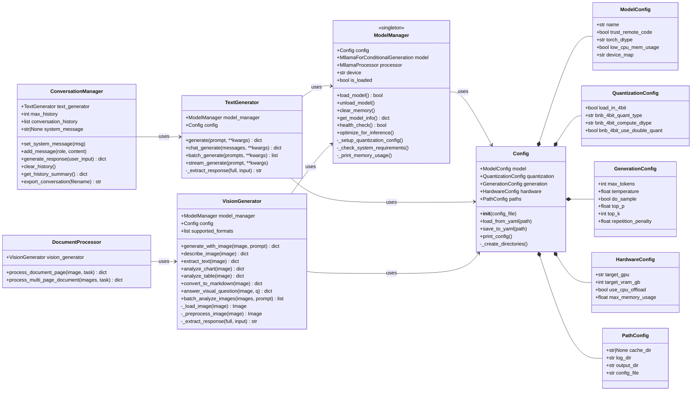
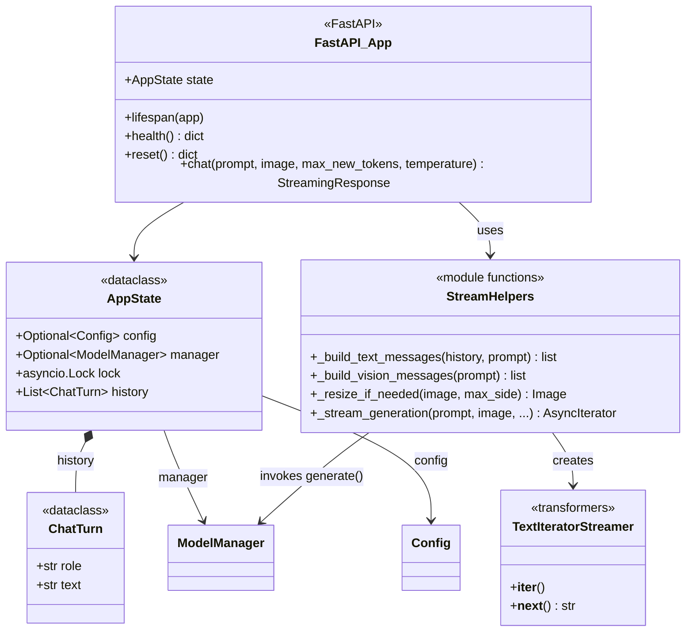
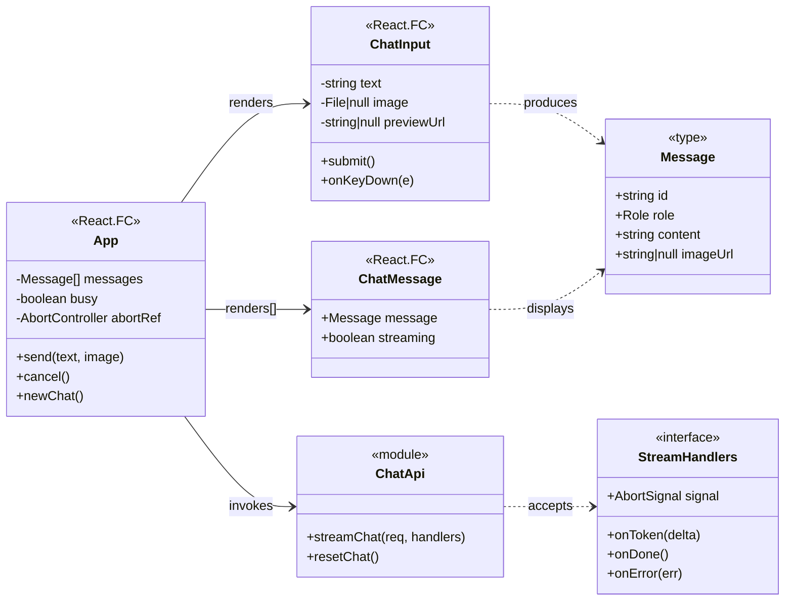
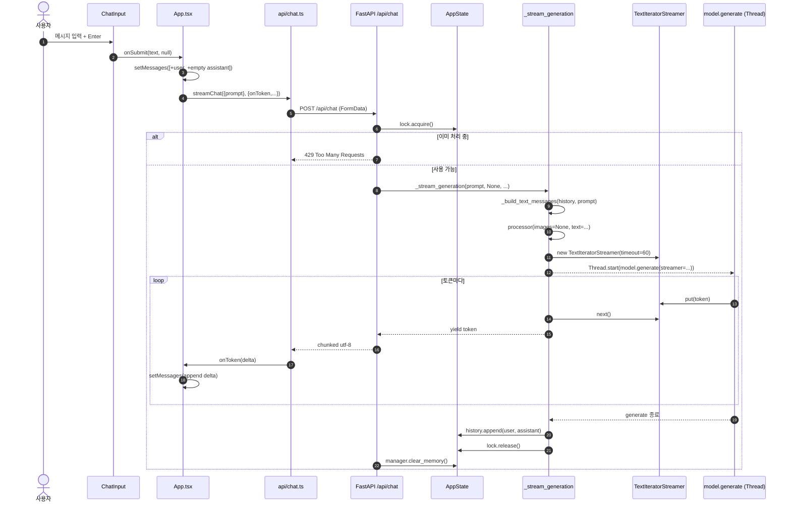
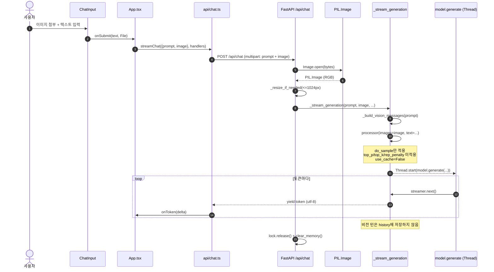
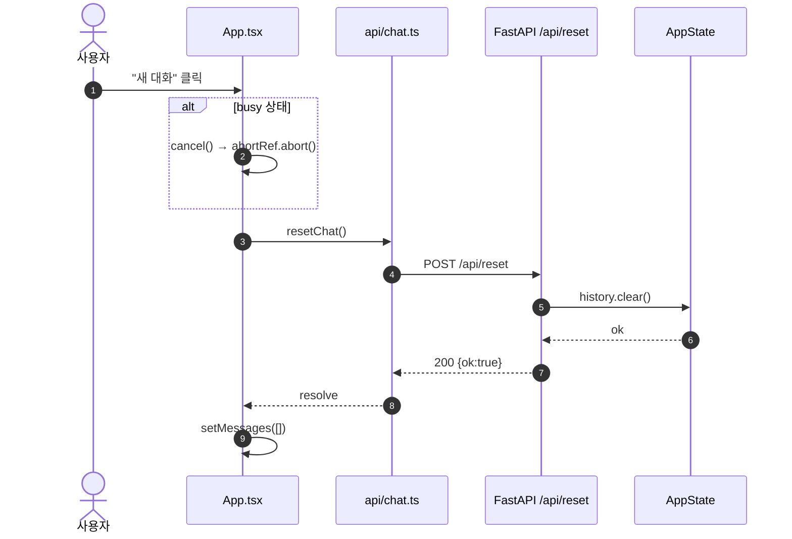
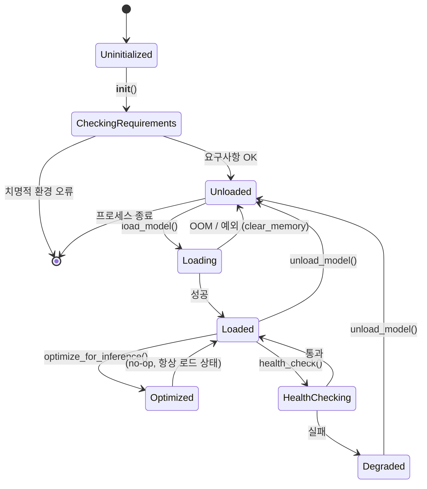
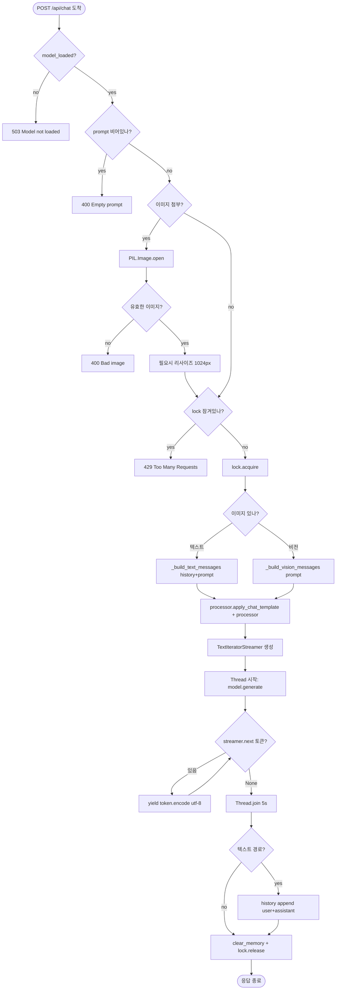
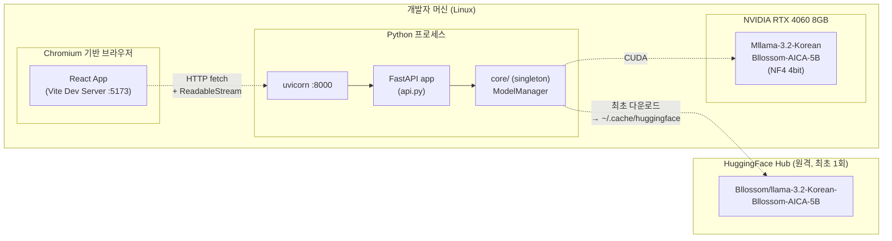
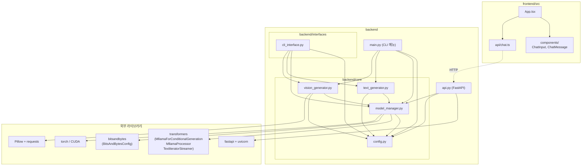

# 📐 UML 다이어그램 (UML Diagrams)

> Korean Bllossom AICA-5B 프로젝트의 UML 다이어그램 모음 (Mermaid 기반)

GitHub, VS Code, JetBrains IDE는 Mermaid를 기본 렌더링하므로 본 문서를 그대로 열면 도식이 보입니다.

---

## 목차
1. [클래스 다이어그램 (Backend Core)](#1-클래스-다이어그램-backend-core)
2. [클래스 다이어그램 (FastAPI Layer)](#2-클래스-다이어그램-fastapi-layer)
3. [컴포넌트 다이어그램 (Frontend)](#3-컴포넌트-다이어그램-frontend)
4. [시퀀스 다이어그램 — 텍스트 채팅](#4-시퀀스-다이어그램--텍스트-채팅)
5. [시퀀스 다이어그램 — 이미지 + 텍스트](#5-시퀀스-다이어그램--이미지--텍스트)
6. [시퀀스 다이어그램 — 대화 초기화](#6-시퀀스-다이어그램--대화-초기화)
7. [상태 다이어그램 — ModelManager](#7-상태-다이어그램--modelmanager)
8. [활동 다이어그램 — 스트리밍 생성](#8-활동-다이어그램--스트리밍-생성)
9. [배포 다이어그램](#9-배포-다이어그램)
10. [패키지 다이어그램](#10-패키지-다이어그램)

---

## 1. 클래스 다이어그램 (Backend Core)

`backend/core` 패키지의 도메인 모델입니다.

---

## 2. 클래스 다이어그램 (FastAPI Layer)

`backend/api.py`의 HTTP 계층 데이터 모델입니다.

---

## 3. 컴포넌트 다이어그램 (Frontend)

React 트리와 모듈 의존성입니다.

---

## 4. 시퀀스 다이어그램 — 텍스트 채팅

사용자가 텍스트를 보내고 토큰 스트림을 받는 정상 경로입니다.

---

## 5. 시퀀스 다이어그램 — 이미지 + 텍스트

비전 경로는 히스토리를 누적하지 않고 샘플링 옵션도 보수적으로 적용합니다.

---

## 6. 시퀀스 다이어그램 — 대화 초기화

---

## 7. 상태 다이어그램 — ModelManager

---

## 8. 활동 다이어그램 — 스트리밍 생성

---

## 9. 배포 다이어그램

---

## 10. 패키지 다이어그램

소스 트리의 패키지 의존 관계입니다.

---

## 부록 A. 다이어그램 갱신 가이드

다이어그램을 수정할 때:
1. **Mermaid 문법 검증** — VS Code의 *Markdown Preview Mermaid* 또는 https://mermaid.live 로 미리 검증.
2. **클래스 변경 시** — `1. 클래스 다이어그램`을 우선 갱신하고, 관련된 시퀀스 다이어그램의 participant 이름이 일치하는지 확인.
3. **API 추가 시** — `2. FastAPI Layer` + 신규 시퀀스 다이어그램 + `8. 활동 다이어그램`까지 점검.
4. **프론트엔드 컴포넌트 추가 시** — `3. 컴포넌트 다이어그램`에 박스를 추가하고 `App` 또는 부모 컴포넌트로부터의 `renders` 화살표를 그릴 것.
